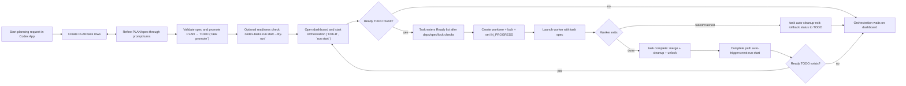

<h1>codex-tasks</h1>

<p align="center">
  
</p>

<p align="center">
  <strong>Orchestration SKILL and CLI for parallel Codex workers</strong>
</p>

<p align="center">
  <a href="#installation">Installation</a> |
  <a href="#usage">Usage</a> |
  <a href="#how-it-works">How It Works</a> |
</p>

<p align="center">
  
  
  
  
  
</p>

## Why this repository exists

This repository is intentionally split:

- Humans create and standardize plans in Codex App through interactive back-and-forth with the `codex-tasks` skill.
- `codex-tasks` CLI executes that plan in a deterministic, repeatable way.

Planning is always done through this interactive exchange; files are not edited directly.

The skill is the source of intent. The CLI is the repeatable executor.

## Installation

### 1. Install CLI

```bash
curl -fsSL https://raw.githubusercontent.com/jaycho46/codex-tasks/main/scripts/install-codex-tasks.sh | bash
```

### 2. Install dependencies

Required:

- `git`
- `python3`
- `codex` CLI
- `tmux` (default worker backend)
- `textual` 


```bash
brew install tmux
python3 -m pip install textual
```

### 3. Install Skill in Codex App

```text
$skill-installer Install skill from GitHub:
- repo: jaycho46/codex-tasks
- path: skills/.curated/codex-tasks
```

## Usage

### 0. Initialize

Run initialization once per repository before planning starts.

Prompt examples are marked with the `prompt` code fence so they are clearly separated from shell commands.

You can do this through the prompt flow:

```prompt
$codex-tasks
Initialize first.
```

### 1. Conversation-Based Task Planning

Use the skill for planning tasks through interactive turns. The CLI is not for manually composing planning strategy.

The detailed spec is intentionally drafted through conversation. Use follow-up prompts to refine and expand each task spec until it is detailed enough for reliable execution.

Planning and execution can continue in parallel. Even while orchestration is running, you can keep creating, refining, and validating tasks through prompt turns.

`initialize` must be done before writing tasks.

### Recommended prompt pattern

1) Create initial tasks (first turn)

```prompt
$codex-tasks
Create tasks for [AAA].
These tasks will be completed on the [feat/AAA] branch.
.
.
.
```

2) Refine specs after review (+second turn)

```prompt
Please change the generated task list and spec files
.
.
.
```

3) Promote to executable queue (last turn)

```prompt
Promote tasks in this conversation to TODO so they are ready for orchestration.
Run a readiness check after promotion.
```

After the skill runs, it creates/updates:

- `.codex-tasks/planning/TODO.md`
- `.codex-tasks/planning/specs/<branch>/<task_id>.md`

### 2) Orchestration with Dashboard (CLI)

`codex-tasks` provides a built-in TUI dashboard for monitoring and managing live orchestration.

The dashboard is the control surface for the project queue:

- Tasks/Logs (all current task rows and status)
- Ready Tasks (executable tasks currently eligible to run)
- Running Agents (active worker sessions and live output)

You can keep planning and refining tasks through prompts while orchestration is in progress.

Open dashboard:

```bash
codex-tasks
```

- `Ctrl+R`: start orchestration (`run start`)
- `Ctrl+E`: emergency stop all in-progress tasks (rollback included)
- `Tasks`: open a row to view and inspect TODO specs
- `Running Agents`: open a row to inspect each active agent, current step, and live logs

## How It Works



## License

MIT. See `LICENSE`.
