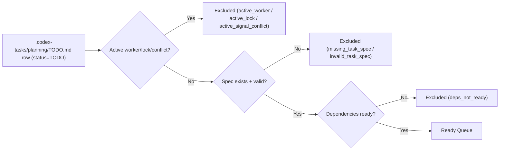
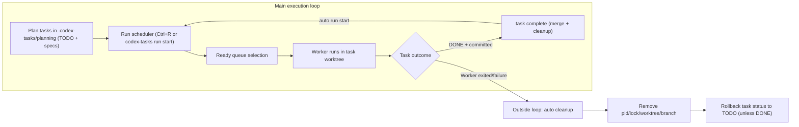

<h1>codex-tasks</h1>

<p align="center">
  
</p>

<p align="center">
  <strong>Orchestration SKILL and CLI for parallel Codex workers</strong>
</p>

<p align="center">
  <a href="#best-practice-recommended">Best Practice</a> |
  <a href="#install-cli">Install CLI</a> |
  <a href="#quickstart-app--terminal-flow">Quickstart</a> |
  <a href="#docs">Docs</a>
</p>

<p align="center">
  
  
  
  
  
</p>

## Best Practice (Recommended)

Use a split workflow:

1. Codex app + `$codex-tasks` skill: create/refine TODO tasks and task specs.
2. Terminal + `codex-tasks`: start scheduler, monitor runtime, and control operations.

This keeps planning in the app and orchestration in the terminal.

## Install CLI

```bash
curl -fsSL https://raw.githubusercontent.com/jaycho46/codex-tasks/main/scripts/install-codex-tasks.sh | bash
```

Default install paths:

- payload: `~/.local/share/codex-tasks/<version>/scripts`
- launcher: `~/.local/bin/codex-tasks`

## Install Codex Skill

In Codex app, run `$skill-installer` with:

```text
$skill-installer Install skill from GitHub:
- repo: jaycho46/codex-tasks
- path: skills/.curated/codex-tasks
```

Skill file in this repo: `skills/.curated/codex-tasks/SKILL.md`

## Requirements

- `git`
- `python3`
- `codex` CLI (required for worker launch; optional with `run start --no-launch`)
- `tmux` (required only for default launch mode)
- optional TUI dependency:

```bash
python3 -m pip install textual
```

## Quickstart: App + Terminal Flow

### 1) In Codex app, create tasks with skill guardrails

Codex app prompt example:

```text
$codex-tasks
Plan authentication work and create an executable TODO list with task specs.
Split work by feature branch,
and write concrete subtasks for each task spec so delegation can run automatically.
```

### 2) Planning files default to `.codex-tasks/planning/` (gitignored)

Default planning paths:

- `.codex-tasks/planning/TODO.md`
- `.codex-tasks/planning/specs/<branch>/<task_id>.md`

Because `.codex-tasks/` is usually in `.gitignore`, planning updates stay local by default.

### Optional: keep planning files out of Git

If task-planning Git changes cause too much churn, you can move planning artifacts
outside the repository and keep only code changes in Git.

Configure `.codex-tasks/orchestrator.toml`:

```toml
[repo]
todo_file = "../codex-tasks-worktrees/.planning/TODO.md"
spec_dir = "../codex-tasks-worktrees/.planning/specs"
state_dir = "../codex-tasks-worktrees/.codex-tasks-shared"
```

Notes:

- `todo_file` and `spec_dir` now support absolute or repo-relative paths.
- keep runtime state (`state_dir`) ignored in Git; `codex-tasks init --gitignore yes` handles this when state is inside the repo.
- this keeps planning artifacts outside the repo, but all participants must point to the same shared paths to collaborate on one queue.

### 3) In terminal, orchestrate execution

```bash
# open live dashboard (default command)
codex-tasks
```


Then press `Ctrl+R` in the dashboard to run scheduler start.

Dashboard operations:

- In the Task table, select a task and press `Enter` to open a spec-detail overlay.
- In the Running Agents table, select (or click) an agent row to open a session overlay and inspect live execution progress.
- If execution is going wrong, press `Ctrl+E` to stop all active tasks. This runs emergency stop (`task stop --all --apply`), cleans runtime state, and rolls affected tasks back to `TODO`.

## How It Works

`codex-tasks` uses `.codex-tasks/planning/TODO.md` as a dependency-aware queue and applies a strict task lifecycle.

1. Queue build (`.codex-tasks/planning/TODO.md` -> ready/excluded)

- Scheduler scans `.codex-tasks/planning/TODO.md` and evaluates only rows with `TODO` status.
- Each TODO row can carry its own `Branch` (base branch) for worker worktree start.
- A task is added to the ready queue only when:
  - no active worker, active lock, or conflicting runtime signal exists
  - dependencies are ready
  - spec file exists and is valid (`.codex-tasks/planning/specs/<branch>/<task_id>.md`)
- Non-ready tasks stay visible as excluded with reasons such as `deps_not_ready`, `missing_task_spec`, or `invalid_task_spec`.



2. Start phase (`run start`)

- Scheduler acquires a run lock to avoid concurrent starts.
- For each ready task, it creates/starts a dedicated worktree + branch.
- It writes runtime metadata (lock + pid) and launches a worker (`codex exec`, default backend: `tmux`).

3. Runtime phase

- Workers execute inside their task worktrees and report progress/status.
- If specs include `## Subtasks` (scaffolded by default), workers use them for subagent delegation.
- Dashboard shows the ready queue, running workers, and excluded reasons in one view.

4. Auto cleanup / recovery

- If a worker exits unexpectedly, auto-cleanup runs for that task.
- It removes stale runtime state (pid/lock/worktree/branch) and rolls the task back to `TODO` unless it is already `DONE`.

5. Completion phase (`task complete`)

- Completion is accepted only when the task is `DONE`, tracked changes are committed, and lock agent/scope match.
- `task complete` merges into base branch (default `rebase-then-ff`) via a dedicated merge worktree, serializes concurrent merge attempts, clears runtime metadata, removes worktree/branch, and automatically runs the next scheduler start by default (disable with `--no-run-start`).

Continuous loop view:



Failed tasks re-enter the queue on the next scheduler run.

## Docs

- Task authoring: [`docs/task-authoring-with-scaffold-specs.md`](docs/task-authoring-with-scaffold-specs.md)
- Worker rules: [`scripts/prompts/codex-worker-rules.md`](scripts/prompts/codex-worker-rules.md)

## License

MIT. See `LICENSE`.
